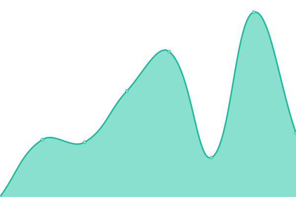

# [📈 Live Status](https://yangbvv.github.io/upptime): <!--live status--> **🟥 Complete outage**

This repository contains the open-source uptime monitor and status page for [yangbvv](https://yangbvv.github.io/upptime), powered by [Upptime](https://github.com/upptime/upptime).

With [Upptime](https://upptime.js.org), you can get your own unlimited and free uptime monitor and status page, powered entirely by a GitHub repository. We use [Issues](https://github.com/yangbvv/upptime/issues) as incident reports, [Actions](https://github.com/yangbvv/upptime/actions) as uptime monitors, and [Pages](https://yangbvv.github.io/upptime) for the status page.

<!--start: status pages-->
<!-- This summary is generated by Upptime (https://github.com/upptime/upptime) -->
<!-- Do not edit this manually, your changes will be overwritten -->
<!-- prettier-ignore -->
| URL | Status | History | Response Time | Uptime |
| --- | ------ | ------- | ------------- | ------ |
|  [blog](https://blog.yangbvv.repl.co) | 🟥 Down | [blog.yml](https://github.com/yangbvv/upptime/commits/HEAD/history/blog.yml) | 

 479ms
     
 | 

<a href="https://yangbvv.github.io/upptime/history/blog">98.55%</a>
    

|  [nav](https://nav.yangbvv.repl.co) | 🟥 Down | [nav.yml](https://github.com/yangbvv/upptime/commits/HEAD/history/nav.yml) | 

 5577ms
     
 | 

<a href="https://yangbvv.github.io/upptime/history/nav">94.94%</a>
    

|  [alist](https://alist.yangbvv.repl.co) | 🟥 Down | [alist.yml](https://github.com/yangbvv/upptime/commits/HEAD/history/alist.yml) | 

 3167ms
     
 | 

<a href="https://yangbvv.github.io/upptime/history/alist">0.00%</a>
    

|  [reader](https://reader.yangbvv.repl.co) | 🟥 Down | [reader.yml](https://github.com/yangbvv/upptime/commits/HEAD/history/reader.yml) | 

 416ms
     
 | 

<a href="https://yangbvv.github.io/upptime/history/reader">98.99%</a>
    

|  [drpy](https://drpy.yangbvv.repl.co) | 🟥 Down | [drpy.yml](https://github.com/yangbvv/upptime/commits/HEAD/history/drpy.yml) | 

 2410ms
     
 | 

<a href="https://yangbvv.github.io/upptime/history/drpy">0.00%</a>
    

|  [whoogle-search](https://whoogle-search.yangbvv.repl.co) | 🟥 Down | [whoogle-search.yml](https://github.com/yangbvv/upptime/commits/HEAD/history/whoogle-search.yml) | 

 568ms
     
 | 

<a href="https://yangbvv.github.io/upptime/history/whoogle-search">93.83%</a>
    

|  [uptime-kuma](https://uptime-kuma.yangbvv.repl.co) | 🟥 Down | [uptime-kuma.yml](https://github.com/yangbvv/upptime/commits/HEAD/history/uptime-kuma.yml) | 

 703ms
     
 | 

<a href="https://yangbvv.github.io/upptime/history/uptime-kuma">98.47%</a>
    

|  [v2](https://v2.yangbvv.repl.co) | 🟥 Down | [v2.yml](https://github.com/yangbvv/upptime/commits/HEAD/history/v2.yml) | 

 3033ms
     
 | 

<a href="https://yangbvv.github.io/upptime/history/v2">0.00%</a>
    

|  [htmly](https://htmly.yangbvv.repl.co) | 🟥 Down | [htmly.yml](https://github.com/yangbvv/upptime/commits/HEAD/history/htmly.yml) | 

 439ms
     
 | 

<a href="https://yangbvv.github.io/upptime/history/htmly">99.07%</a>
    

|  [v3](https://v3.yangbvv.repl.co) | 🟥 Down | [v3.yml](https://github.com/yangbvv/upptime/commits/HEAD/history/v3.yml) | 

 3170ms
     
 | 

<a href="https://yangbvv.github.io/upptime/history/v3">0.00%</a>
    

<!--end: status pages-->

[**Visit our status website →**](https://yangbvv.github.io/upptime)

## 📄 License

- Powered by: [Upptime](https://github.com/upptime/upptime)
- Code: [MIT](./LICENSE) © [yangbvv](https://yangbvv.github.io/upptime)
- Data in the `./history` directory: [Open Database License](https://opendatacommons.org/licenses/odbl/1-0/)
